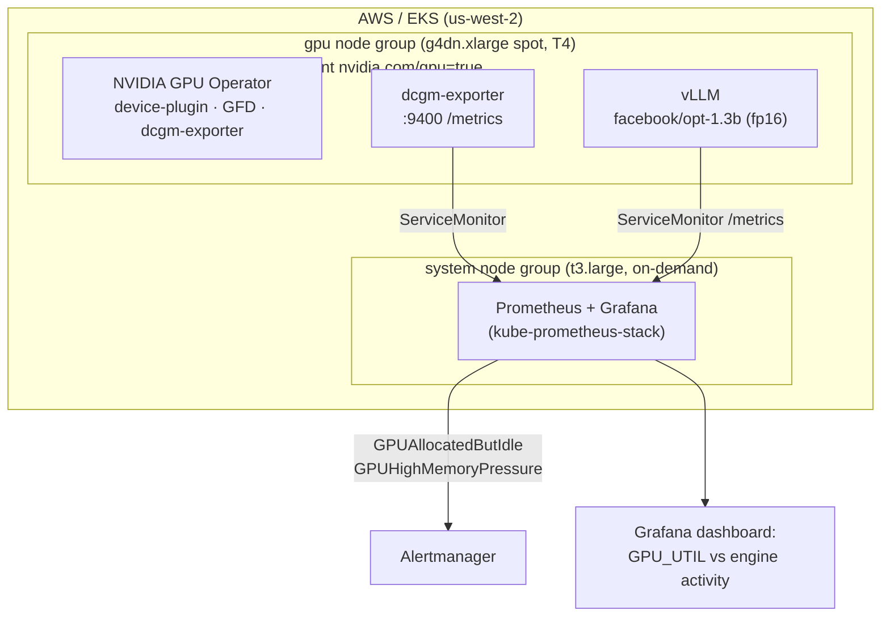

# GPU Observability on EKS

Reliability and cost observability for GPU workloads on Amazon EKS. A real, applyable
cluster that provisions a GPU node pool, installs the **NVIDIA GPU Operator**, serves a
live model with **vLLM**, and surfaces the one metric that actually drives GPU cost:
**the gap between a GPU being _allocated_ and a GPU doing _work_.**

Built to be stood up, demonstrated, and destroyed the same day. Spot `g4dn.xlarge`
(one NVIDIA T4), so a full apply/demo/destroy cycle costs a few dollars.

> Companion to a broader multi-cloud Terraform portfolio
> ([terraform-eks-platform](https://github.com/bibigon14/terraform-eks-platform),
> [terraform-gke-platform](https://github.com/bibigon14/terraform-gke-platform),
> [terraform-aks-platform](https://github.com/bibigon14/terraform-aks-platform)).

## Why this exists

GPUs are the most expensive compute in a cluster, and the default scheduler view of them
is binary and misleading:

- A pod requests `nvidia.com/gpu: 1` and holds a **whole** card. There is no "millicore"
  equivalent - allocation is all-or-nothing unless you configure time-slicing or MIG.
- `nvidia-smi` / `DCGM_FI_DEV_GPU_UTIL` reports "utilization" that only means _a kernel
  was running_. A tiny kernel on one SM shows 100%. A card can look saturated and be
  almost idle.

So the expensive failure mode is a GPU that is **allocated but idle**: memory reserved,
a workload resident, engines doing nothing. On a fleet of A100s that gap is burned money.
This project makes it visible and alerts on it.

## Architecture



Driver and container toolkit come from the EKS GPU-optimized AMI (`AL2_x86_64_GPU`); the
GPU Operator owns only the Kubernetes-facing pieces (device plugin, GFD, DCGM). Everything
is scraped **in-cluster** - no external dependency, clone and apply.

## What's in here

| Path | What |
|------|------|
| `terraform/` | VPC + EKS, a CPU system pool and a spot GPU pool, GPU Operator and kube-prometheus-stack via `helm_release` |
| `manifests/vllm/` | vLLM serving a small model, plus a ServiceMonitor for its Prometheus metrics |
| `manifests/loadgen/` | A Job that drives real inference load so the dashboards show activity |
| `manifests/dcgm/` | Optional custom DCGM counter set (adds `SM_ACTIVE`) |
| `manifests/time-slicing/` | Time-slicing config - software GPU sharing for the T4 (no MIG) |
| `manifests/alerts/` | `GPUAllocatedButIdle` and `GPUHighMemoryPressure` PrometheusRules |
| `dashboards/` | Grafana dashboard: the util-vs-allocation gap |
| `docs/` | Architecture, the cost narrative, and the apply/demo/destroy runbook |

## Quickstart

Prerequisites: an AWS account with the **G/VT instance quotas** raised (spot and/or
on-demand - a fresh account has these at 0), `aws`, `terraform`, `kubectl`, `helm`, and
the remote-state backend bootstrapped (see [`bootstrap.md`](bootstrap.md)).

```bash
cd terraform
export TF_VAR_grafana_admin_password='<something strong>'
terraform init
terraform apply                       # ~15 min (EKS control plane dominates)

aws eks update-kubeconfig --name gpu-observability-demo --region us-west-2
kubectl get nodes -l workload-type=gpu
kubectl describe node -l workload-type=gpu | grep nvidia.com/gpu   # should advertise a GPU

kubectl apply -f ../manifests/vllm/
kubectl -n workloads rollout status deploy/vllm --timeout=10m      # cold start: model load

# watch the gap
kubectl -n monitoring port-forward svc/kube-prometheus-stack-grafana 3000:80
# open http://localhost:3000  ->  GPU / GPU Utilization vs Allocation

kubectl apply -f ../manifests/loadgen/   # drive load, watch engine activity rise
```

Full walkthrough, time-slicing demo, and teardown: [`docs/runbook.md`](docs/runbook.md).

## Teardown

```bash
kubectl delete -f manifests/vllm/ -f manifests/loadgen/
cd terraform && terraform destroy
```

## Cost

Spot `g4dn.xlarge` ~\$0.16/hr + EKS control plane \$0.10/hr + NAT. A same-day
apply/demo/destroy is a few dollars. The GPU pool can be set to `min_size = 0` to scale
to zero between demos.

## Notes / honest scope

This is a platform-reliability project, not model engineering. It owns scheduling,
observability, capacity, and the cost signal around GPUs. Kernel-level CUDA work,
distributed-training communication (NCCL), and fabric tuning (InfiniBand/RDMA) are out
of scope by design.
